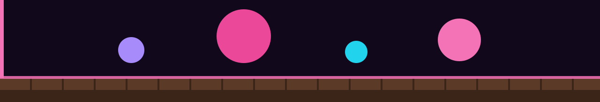
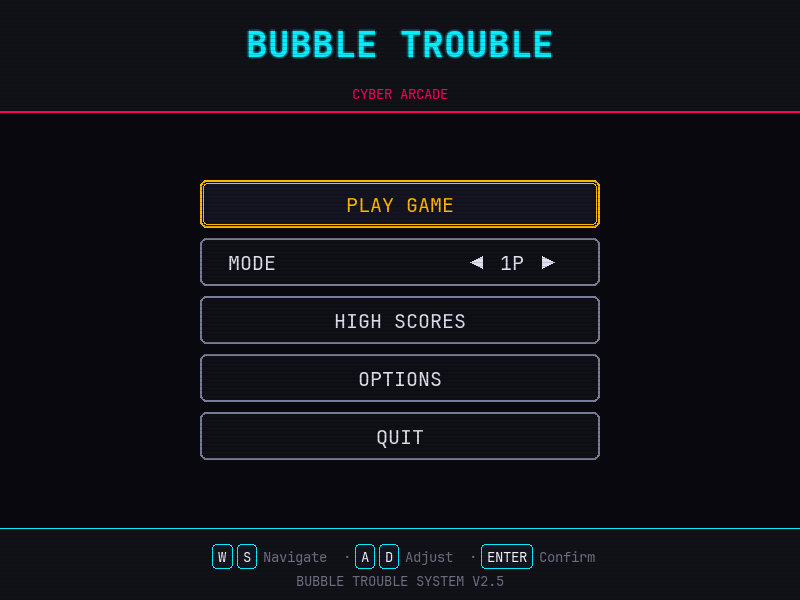
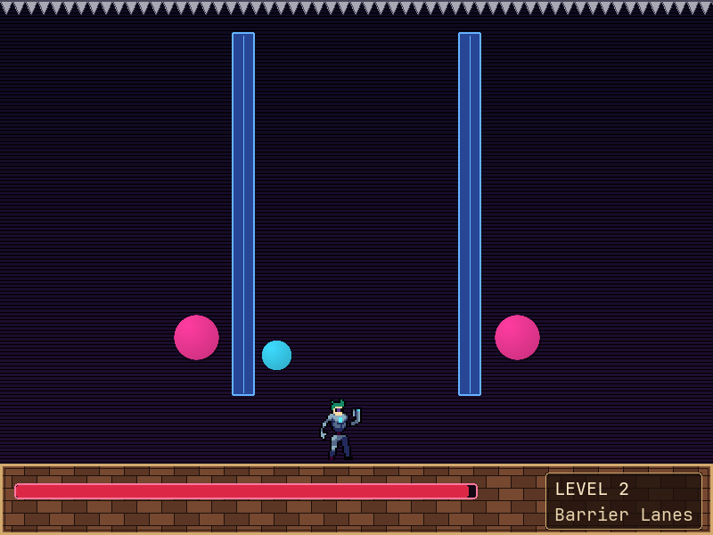
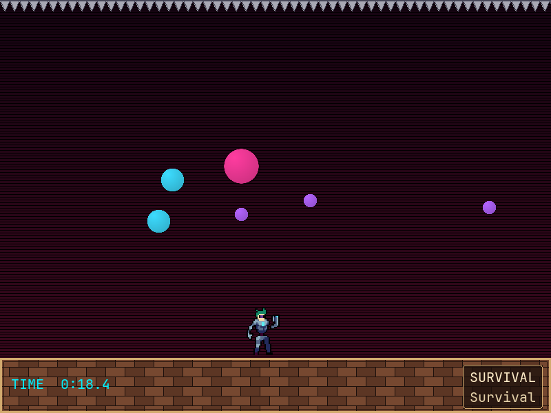
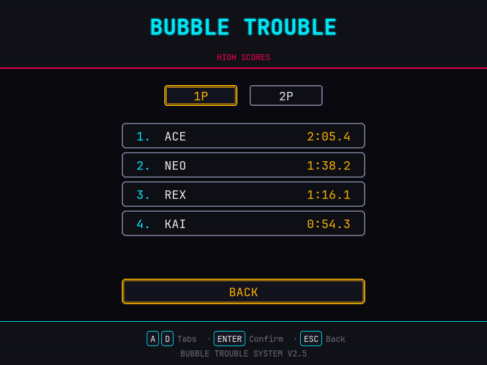
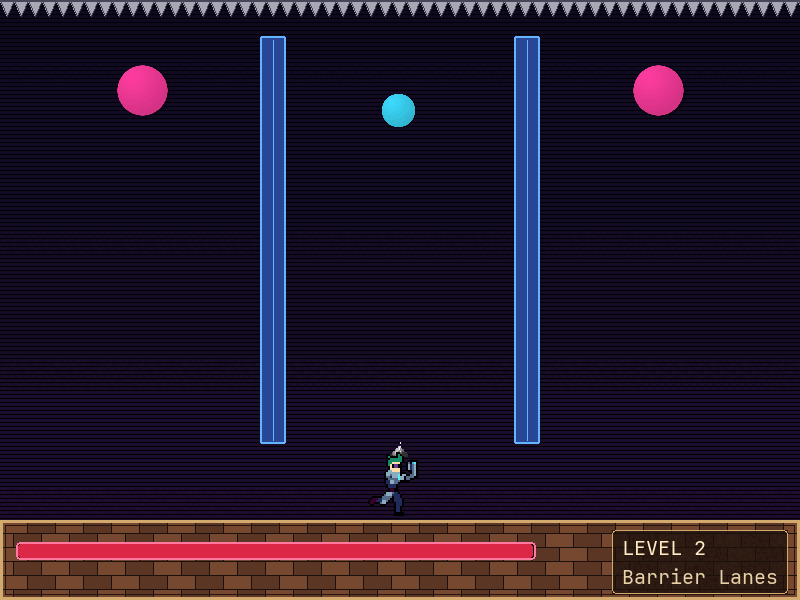

<p align="center">
  
</p>

Unofficial cyberpunk fan remake of Bubble Trouble in Python and pygame. Campaign, survival, and local co-op.
**Portfolio:** [daltondjoesman.github.io](https://daltondjoesman.github.io)

[](LICENSE)

Not affiliated with the original Bubble Trouble / Pang. Code is original ([MIT](LICENSE)); third-party art and audio are listed in [CREDITS.md](CREDITS.md).

Pop bouncing balls with growing chain harpoons. Play a **five-level campaign** against a draining time barrier, or **Survival** against a rising chronometer. Solo or **local co-op**.

| If you want to | Go to |
|----------------|--------|
| See it | [Screenshots](#screenshots) · [Modes](#modes) |
| Play it | [Install](#install) · [Run](#run) |
| Check authorship | [CREDITS.md](CREDITS.md) · HTML files in `designPrototype/` are menu mockups, not the game |

## Screenshots

Full 800×600 window (arena plus bottom status panel, or the menu shell).











## Requirements

- Python 3.10+
- pygame 2.5+ (see `requirements.txt`)

## Install

```bash
python -m venv .venv
source .venv/bin/activate   # Windows: .venv\Scripts\activate
pip install -r requirements.txt
```

## Run

From the repository root:

```bash
python Scripts/main.py
```

The game opens on the main menu (800×600). A match does not start until you confirm Play and pick a level.

Windows / Linux binaries are not in this repo yet; run from source.

## Modes

| Mode | What it is |
|------|------------|
| **Campaign** | Five authored levels. Clear every ball before the shared time barrier empties. Clearing level 5 wins. |
| **Survival** | Endless. Time counts **up**. Balls keep spawning with a difficulty ramp. Last player down ends the run. Qualifying times go to High Scores. |
| **1P / 2P** | Toggle on the menu. 2P is same-screen co-op with distinct keyboards. |
| **High Scores** | Top five Survival times, separate 1P and 2P boards (tab between them). |
| **Options** | Independent music and SFX volume (persisted locally). |

Rules in detail: [docs/gameplay.md](docs/gameplay.md).

## Controls

| Player | Move | Fire |
|--------|------|------|
| P1 | A / D | Space |
| P2 | Left / Right arrows | Enter |

Movement is grounded (no jump). Crawl under barriers and doors through the gap above the floor.

| Context | Keys |
|---------|------|
| Menu | W/S navigate, A/D adjust (mode or volume), Enter/Space confirm, Esc back |
| Level select | W/S (and A/D on the campaign grid), Tab switches Campaign / Survival |
| High Scores | A/D (or Left/Right) switch 1P / 2P boards |
| In match | Esc returns to the menu |
| Win / game over | R restart, M or Esc return to menu |

## Implementation

The gameplay loop in `Scripts/main.py` runs campaign and survival, same-screen co-op input, and the HUD. Balls use gravity and split when hit (`Scripts/ball.py`). The harpoon is a cooldown-limited projectile (`Scripts/bullet.py`). Levels, high scores, menus, and audio live in their own modules. Art and sound are third-party; the split is listed in [CREDITS.md](CREDITS.md).

## Project layout

```
Scripts/           Game code (entry: Scripts/main.py)
assets/            Runtime art (see CREDITS.md)
audio/             Music and SFX (Kenney CC0)
docs/              Gameplay notes and screenshots
designPrototype/   HTML menu mockups — not the game
```

## Credits

Third-party art and audio: [CREDITS.md](CREDITS.md).

## License

[MIT](LICENSE) for original code. Assets keep their own licenses as listed in CREDITS.
